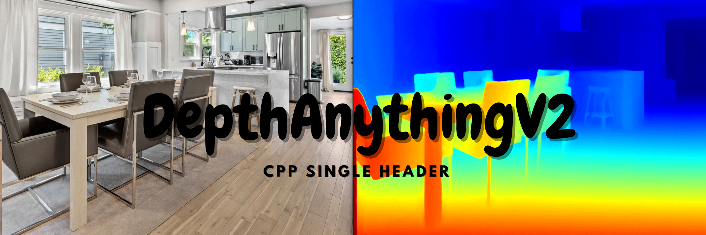

# Depth-Anything-V2-CPP




## Overview

**Depth-Anything-V2-CPP** provides single c++ header with high-performance application designed for real-time depth  estimation using  models from [Depth-Anything-V2](https://github.com/DepthAnything/Depth-Anything-V2). Leveraging the power of [ONNX Runtime](https://github.com/microsoft/onnxruntime) and [OpenCV](https://opencv.org/), this project provides seamless integration for image, video, and live camera inference. Whether you're developing for research, production, or hobbyist projects, this application offers flexibility and efficiency. Also offers flexible execution options, allowing you to choose between TensorRT (TRT), CUDA, or CPU for inference

### Integration in your c++ projects

```cpp
// Include necessary headers
#include <opencv2/opencv.hpp>
#include <iostream>
#include <string>

#include "depth_anything.hpp" // Ensure depth_anything.hpp  is in your include path

int main() {

    std::string modelPath = "models/vits_qint8.onnx ";
    std::string imagePath = "data/indoor.jpg";

    bool useCuda = false; // Change to true if using a CUDA-enabled GPU
    DepthAnything depthEstimator(modelPath, useCuda);

    cv::Mat inputImage = cv::imread(imagePath, cv::IMREAD_COLOR);

    cv::Mat depthMap = depthEstimator.predict(inputImage);

    cv::Mat depthVis;
    cv::normalize(depthMap, depthVis, 0, 255, cv::NORM_MINMAX, CV_8U);
    cv::Mat depthColor;
    cv::applyColorMap(depthVis, depthColor, cv::COLORMAP_JET);

    cv::imshow("Original Image", inputImage);
    cv::imshow("Depth Map", depthColor);
    cv::waitKey(0);


    return 0;
}

```

> **Note:** For more usage, check the source files: [image_depth_estimation.cpp](src/image_depth_estimation.cpp), [video_depth_estimation.cpp](src/video_depth_estimation.cpp), [camera_depth_estimation.cpp](src/camera_depth_estimation.cpp).

## Features


- **Multiple Depth Anything V2 Models**: Supports Depth Anything V2 with standard and quantized ONNX models for flexibility in use cases.
  
- **ONNX Runtime Integration**: Leverages ONNX Runtime for optimized inference on both CPU and GPU, ensuring high performance.
  - **Dynamic Shapes Handling**: Adapts automatically to varying input sizes for improved versatility.
  - **Graph Optimization**: Enhances performance using model optimization with `ORT_ENABLE_ALL`.
  - **Execution Providers**: Configures sessions for CPU or GPU (e.g., `CUDAExecutionProvider` for GPU support).
  - **Input/Output Shape Management**: Manages dynamic input tensor shapes per model specifications.
  - **Optimized Memory Allocation**: Utilizes `Ort::MemoryInfo` for efficient memory management during tensor creation.
  - **Batch Processing**: Supports processing multiple images, currently focused on single-image input.
  - **Output Tensor Extraction**: Extracts output tensors dynamically for flexible result handling.

- **Real-Time Inference**: Capable of processing images, videos, and live camera feeds instantly.

- **Cross-Platform Support**: Fully compatible with Linux, macOS, and Windows environments.

- **Easy-to-Use Scripts**: Includes shell scripts for straightforward building and running of different inference modes.


## Requirements

Before building the project, ensure that the following dependencies are installed on your system:

- **C++ Compiler**: Compatible with C++14 standard (e.g., `g++`, `clang++`, or MSVC).
- **CMake**: Version 3.0.0 or higher.
- **OpenCV**: Version 4.5.5 or higher.
- **ONNX Runtime**: Tested with version 1.16.3 and 1.19.2, backward compatibility [Installed and linked automatically during the build].

## Installation

### Clone Repository

First, clone the repository to your local machine:

```bash 
git clone https://github.com/Geekgineer/Depth-Anything-V2-CPP
cd Depth-Anything-V2-CPP
```

### Configure

1. make sure you have opencv c++ installed
2. set the ONNX Runtime version you need e.g. ONNXRUNTIME_VERSION="1.16.3" in [build.sh](build.sh) to download ONNX Runtime headers also set GPU.


### Build the Project

Execute the build script to compile the project using CMake:

```bash
./build.sh
```

This script will download onnxruntime headers, create a build directory, configure the project, and compile the source code. Upon successful completion, the executable files (camera_inference, image_inference, video_inference) will be available in the build directory.

### Usage

After building the project, you can perform depth estimation on images, videos, or live camera feeds using the provided shell scripts.

#### Run Image Inference

To perform depth estimation on a single image:

```bash
./run_image.sh 
```

This command will process indoor.jpg using e.g. vits_qint8 model and display the output depth image.

#### Run Video Inference

To perform depth estimation on a video file:

```bash
./run_video.sh 
```

**Example:**
```bash
./run_video.sh 
```

#### Run Camera Inference

To perform real-time depth estimation using a usb cam:

```bash
./run_camera.sh 
```

This command will activate your usb and display the video feed with real-time depth estimation.

Below is a demonstration of the camera depth estimation cpu only:


### Models


The project includes various pretrained Depth Anything V2 models stored in the `models` directory:

| Model Type       | Model Name                |
|------------------|---------------------------|
| **Standard Models**    | vits.onnx                  |
|                  | vits_sim.onnx              |
|                  | vits_fp16.onnx             |
| **Quantized Models**   | vits_qint8.onnx            |
|                  | vits_qint8_sim.onnx        |
****


### Contributing

Contributions are welcome! Please follow these steps to contribute:

1. **Fork the Repository**: Click the "Fork" button at the top-right corner of this repository to create a personal copy.
2. **Clone Your Fork**:
    ```bash
    git clone https://github.com/Geekgineer/Depth-Anything-V2-CPP
    cd Depth-Anything-V2-CPP
    ```
3. **Create a New Branch**:
    ```bash
    git checkout -b feature/YourFeatureName
    ```
4. **Make Your Changes**: Implement your feature or bug fix.
5. **Commit Your Changes**:
    ```bash
    git commit -m "Add feature: YourFeatureName"
    ```
6. **Push to Your Fork**:
    ```bash
    git push origin feature/YourFeatureName
    ```
7. **Create a Pull Request**: Navigate to the original repository and click "New Pull Request" to submit your changes for review.

### License

This project is licensed under the MIT License. You are free to use, modify, and distribute this software in accordance with the terms of the license.

### Acknowledgment

- [https://github.com/DepthAnything/Depth-Anything-V2](https://github.com/DepthAnything/Depth-Anything-V2)
- [https://github.com/spacewalk01/depth-anything-tensorrt](https://github.com/spacewalk01/depth-anything-tensorrt)
- [https://github.com/zhujiajian98/Depth-Anythingv2-TensorRT-python](https://github.com/zhujiajian98/Depth-Anythingv2-TensorRT-python)
- [https://github.com/fabio-sim/Depth-Anything-ONNX](https://github.com/fabio-sim/Depth-Anything-ONNX)
- [https://huggingface.co/spaces/Xenova/webgpu-realtime-depth-estimation](https://huggingface.co/spaces/Xenova/webgpu-realtime-depth-estimation)
